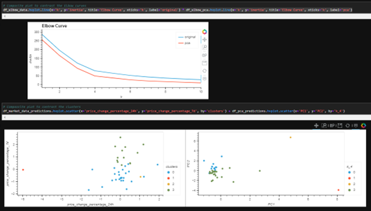

# Database-and-Web-App-for-Analyzing-ETF

This repo contains the results of the module 10 challenge. To view the file, open the "clusters" folder and then the "crypto_investments.ipynb" file. 

I assumed the role of an advisor at a financial advisory firm proposing a novel approach to assembling investment portfolios that are based on cryptocurrencies. Instead of basing the proposal on only returns and volatility, I included other factors that might impact the crypto market.

The goal was to combine financial Python programming skills with the unsupervised learning skills acquired in this module. To do so, I created a Jupyter notebook that clusters cryptocurrencies by their performance in different time periods. I then plotted the results to visually show the performance.

Specifically, I completed the following steps:

(1) Imported the Data 
(2) Prepared the Data 
(3) Found the Best Value for k Using the Original Data
(4) Clustered Cryptocurrencies with K-means Using the Original Data
(5) Optimized Clusters with Principal Component Analysis
(6) Found the Best Value for k Using the PCA Data
(7) Clustered the Cryptocurrencies with K-means Using the PCA Data
(8) Visualized and Compared the Results

## Installation Guide

First, scikit-learn was installed into the development environment.

```python
pip install -U scikit-learn
```
---

## Technologies

This project leverages python 3.7 with the following libraries and dependencies:

* [pandas](https://github.com/pandas-dev/pandas) - For manipulating data

* [hvplot](https://github.com/holoviz/hvplot) - High-level plotting API for the PyData ecosystem built on HoloViews

* [sklearn](https://github.com/scikit-learn/scikit-learn) - Module for machine learning built on top of SciPy

---

### **Found the Best Value for k Using the Original Data**

In this section, I used the elbow method to find the best value for k by completing the following steps:

(1) Coding the elbow method algorithm to find the best value for k, using a range from 1 to 11.

(2) Plotting a line chart with all the inertia values computed with the different values of k to visually identify the optimal value for k.

    I also answered the following question: 
    
    What is the best value for k?

### **Clustered Cryptocurrencies with K-means Using the Original Data**

Here, I used the K-means algorithm with the best value for k (found in the previous section) to cluster the cryptocurrencies according to the price changes of cryptocurrencies provided. To do so, I completed the following steps:

(1) Initialized the K-means model with four clusters by using the best value for k.

(2) Fit the K-means model using the original data.

(3) Predicted the clusters to group the cryptocurrencies using the original data. Viewed the resulting array of cluster values.

(4) Created a copy of the original data and added a new column with the predicted clusters.

(5) Using hvPlot, createed a scatter plot by setting `x="price_change_percentage_24h"` and `y="price_change_percentage_7d"`. Colored the graph points with the labels found using K-means. Then, added the crypto name in the `hover_cols` parameter to identify the cryptocurrency represented by each data point.

### **Optimized Clusters with Principal Component Analysis**

In this section, I performed a principal component analysis (PCA) and reduced the features to three principal components by applying the steps as follows:

(1) Created a PCA model instance and set `n_components=3`.

(2) Used the PCA model to reduce to three principal components. Viewed the first five rows of the DataFrame.

(3) Retrieved the explained variance to determine how much information can be attributed to each principal component.

    Here, I answered the following question: 
    
    What is the total explained variance of the three principal components?

(4) Created a new DataFrame with the PCA data. Set the `coin_id` index from the original DataFrame as the index for the new DataFrame. Reviewed the resulting DataFrame.

### **Found the Best Value for k Using the PCA Data**

This section used the elbow method to find the best value for k using the PCA data. The following steps were applied:

(1) Coded the elbow method algorithm and use the PCA data to find the best value for k. Used a range from 1 to 11.

(2) Plotted a line chart with all the inertia values computed with the different values of k to visually identify the optimal value for k.

    I also answered the following questions: 
    
    What is the best value for k when using the PCA data? 
    
    Does it differ from the best k value found using the original data?

### **Clustered Cryptocurrencies with K-means Using the PCA Data**

This section required the use of the PCA data and the K-means algorithm with the best value for k (found in the previous section) to cluster the cryptocurrencies according to the principal components. To do so, I applied the following steps:

(1) Initialized the K-means model with four clusters by using the best value for k.

(2) Fit the K-means model by using the PCA data.

(3) Predicted the clusters to group the cryptocurrencies by using the PCA data. Viewed the resulting array of cluster values.

(4) Created a copy of the DataFrame with the PCA data and added a new column to store the predicted clusters.

(5) Using hvPlot, created a scatter plot by setting `x="price_change_percentage_24h"` and `y="price_change_percentage_7d"`. Colored the graph points with the labels found using K-means. Then, added the crypto name in the `hover_cols` parameter to identify the cryptocurrency represented by each data point.

### **Visualized and Compare the Results**

Finally, I visually analyzed the cluster analysis results by observing the outcome with and without using the optimization techniques by applying the following steps:

(1) Created a composite plot using hvPlot and the plus (+) operator to compare the elbow curve that I created to find the best value for k with the original data and the PCA data.

(2) Created a composite plot using hvPlot and the plus (+) operator to compare the cryptocurrencies clusters using the original data and the PCA data.



    I also answered the following question: 
    
    After visually analyzing the cluster analysis results, what is the impact of using fewer features to cluster the data by using K-means?
    
---
## Contributors

Brought to you by Wilson Rosa. https://www.linkedin.com/in/wilson-rosa-angeles/.

---
## License

MIT